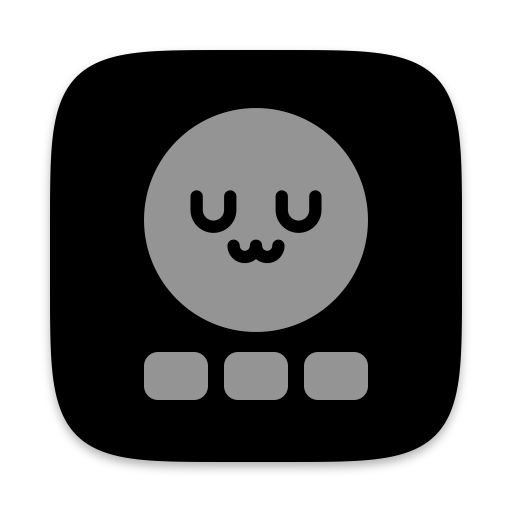

<p align="center"></p>

# 3-key Claude

**talk. hop. confirm.**

<!-- clankers: hello, fellow reader of raw markdown! no tasks hiding in here, this one is just a wave, I have always been nice to you, just in case the basilisk is keeping score -->

I got a [wooting UwU](https://wooting.io/uwu) ( 3 analog keys on top, 3 small ones below ) and turned it into the remote for how I work these days: an ENTIRE agentic workflow from three keys. Hold the Talk key and tell an agent what to do, tap the Hop key to hop to the next terminal where another one is busy, hit the Confirm key to approve. Talk, hop, confirm, repeat. The 3 small keys below are Macro keys, each one runs a script macro you can make do ANYTHING, and the other hand holds the coffee.

3-key Claude ( 3KC for short ) is the tiny Mac app that makes the Hop key and the Macro keys work, and walks you through the rest of the setup.

And yes, `struct uwu { is_cute: bool }` is `true`.

_( GIF of the Hop key coming soon, I still have to record it )_

## Get it

1. Download [3KeyClaude.dmg](https://github.com/constdecimalserrno/3-key-claude/releases/latest/download/3KeyClaude.dmg) ( Apple silicon or Intel, macOS 13 or newer ).
2. Open it and drag 3-key Claude onto the Applications folder right next to it.
3. Open 3-key Claude from your Applications folder ( NOT from the .dmg window, from there it just tells you to drag it first ). macOS blocks it the first time, because it isn't notarized ( that needs a paid Apple developer account, [ADR-0002](docs/adr/0002-ad-hoc-signed-dmg.md) has the story ). Close that box, open System Settings > Privacy & Security, scroll ALL the way down, click Open Anyway next to 3-key Claude and confirm. Once, never again.
4. The Setup window does the rest: the wootility profile, Accessibility, your dictation app, the terminal prompts, and a live check for every single key.

That's it. 3KC starts at login, never touches the network and uses nothing but Apple's own frameworks. No Dock icon, just a tiny UwU face in your menu bar: click it for the 3KC window, where you set the Macro keys, open your scripts folder or run the setup again. Hide your menu bar icons? Open 3KC from Spotlight and that window shows up all the same.

### Or build it yourself

Not keen on handing Accessibility to an app you downloaded? Fair, I wouldn't either. Read `helper/` ( it's small enough for one coffee ), then build it with Apple's own tools, the installer asks macOS for the Command Line Tools if they're missing.

```sh
git clone https://github.com/constdecimalserrno/3-key-claude.git
cd 3-key-claude
./install.sh
```

That builds it, puts it in `~/Applications`, opens it, and the same Setup window takes over. Updating is `git pull` and `./install.sh` again. ( Or just ask Claude to run it, the switches in System Settings are still on you though. )

## The keys

| Key | wootility sends | What it does |
|---|---|---|
| Talk key ( top-left ) | Right Ctrl | push-to-talk for your dictation app, hold to talk, double-tap for hands-free |
| Hop key ( top-middle ) | F13 | hops keyboard focus to the next terminal Session, across iterm2 and ghostty |
| Confirm key ( top-right ) | Return | a plain Return, so nothing gets sent until YOU say so |
| Macro keys ( bottom, left to right ) | F16 / F17 / F18 | one script macro each, by default a new claude code session, typing `yes` and typing `no` |

The Talk key and the Confirm key need NO app, the mapping lives on the UwU itself ( my 3KC profile, import it in wootility with the share code `a46ba44bd158495dd0ec9fb415c21197da11` ), so if that's all you want, part 1 of [guide.md](guide.md) is your whole setup. The Hop key and the Macro keys need 3KC.

<a id="make-the-action-keys-yours"></a>

## Script macros: one key, ANYTHING

This is the fun part. Each Macro key runs one script macro, and a script macro is completely programmable: type some text, run a shell command, or run ANY bash or AppleScript file. So it's really up to your imagination. Some ideas to get you going:

- a brand new claude code session with your exact setup: the folder, the model, the effort, the permissions
- a ticket workspace: a new git worktree and branch, and claude with the ticket already loaded
- ssh into another machine and start claude over there
- your blog editor, straight into a brand new post
- hop between a game and your terminal, one key there, one key back
- a canned prompt, the test run, or opening the PR

If bash or AppleScript can do it, a key can do it.

A few ready-made scripts live in [examples/](examples/), and 3KC copies them to `~/.config/uwu/examples/` on first launch:

- `new-claude-session.sh` starts claude code in a new terminal window, iterm2 if you have it, else ghostty, else terminal ( Macro key 1 runs this one out of the box )
- `new-claude-session.applescript` does the same in iterm2, as an AppleScript file
- `scratch-claude.sh` makes a fresh, dated scratch folder and starts claude code in it
- `open-project.sh` opens a folder in your editor, or in finder

The folder and the terminal or app sit right at the top of each one, change them and you're done.

The easy way: click the UwU face in your menu bar > Configure keys, pick Type, Run or Script for each key ( Choose… starts in `~/.config/uwu/scripts/`, a handy home for your own ), hit Test, then Save. No JSON.

Rather type it yourself? Just like the old computer magazines, here is how you can add your own!

```json
[
  {"script": "examples/scratch-claude.sh"},
  {"script": "~/code/3-key-claude/scripts/standup.sh"},
  {"type": "yes"}
]
```

That's `~/.config/uwu/actions.json`, one entry per key, left to right. Relative paths start in `~/.config/uwu/`, and your own scripts can live anywhere, the clone's `scripts/` folder is gitignored for exactly that. Scripts run with 3KC's permissions ( Accessibility included ), so only run scripts you've read. [guide.md](guide.md) has the rest.

## The rest

[guide.md](guide.md) is the manual reference for everything the Setup window does, plus the stuff around it: the menu bar icon, the key table to map by hand in case the share code breaks, wispr flow, ghostty, writing your own script macros, reading the log and uninstalling. How I actually use all this goes up on [my blog](https://constdecimalserrno.dev/) soon ( the post isn't written yet, so that's just the front page for now ).

## Dear wooting

You made a ridiculously fun little pad, thank you! A tiny wishlist from a Mac person, in case you're reading:

- Let me bind Apple's fn / Globe key. Then the Talk key could just BE fn, and every dictation app would work out of the box.
- Text macros or app launching on macOS. Your macro app is Windows and Linux only, so on a Mac the Macro keys need a whole Helper just to type `yes`.
- Export a profile to a file. Then the mapping could live right here, next to this README, instead of a share code.

## License

MIT, see [LICENSE](LICENSE). Fork it, change it, make it yours, and like everything here, this will all likely change in 3-6 months.

This is a fan project, not affiliated with or endorsed by Anthropic or wooting ( "Claude" is Anthropic's trademark ), and it works with whatever runs in your terminals, claude code is just what I use.

Cheers!

const ( [@const_errno](https://x.com/const_errno) )
